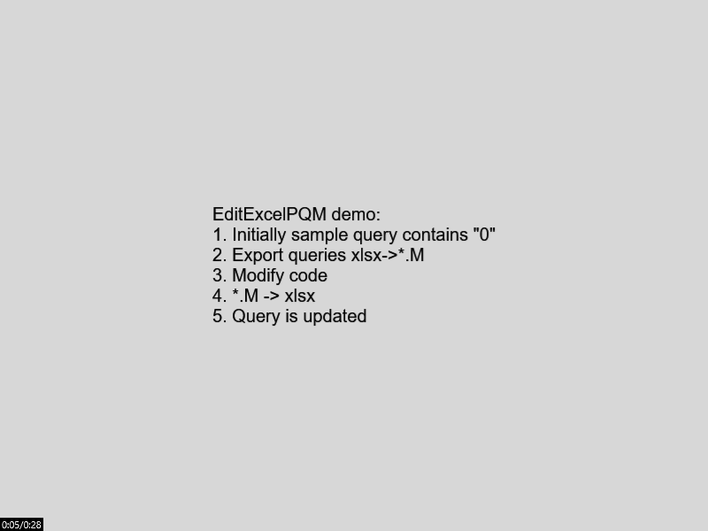

# EditExcelPQM - edit M code of your xlsx in VSCode
Want to export and edit Power Query M code of your xlsx file in VSCode and get it back to xlsx? - Here is the plugin. 

Please note
* Plugin adds 4 items in right button pop-up menu named EEPQM***
* It takes ~10 seconds for plugin to startup and show menu items
* When you click M->Excel, it only says Excel process to update worksheet parameters, but **doesn't save** your file
* In order to save your changes you need either to close Excel manually or click 'EEPQM: Close with saving'
* Close actions from popup **doesn't kill** Excel process, but hides it. Dont know how to kill it fully
* It uses COM api to export queries, so it starts an Excel instance
* Unfortunately, I can only start a new Excel instance. I cant use existing one. So, if you have already opened a spreadsheet with M, I will open it again in separate process. If you try to save, it causes exception
* If Excel shows popups on startup, export fails. You need to close Excel popup manually
* Some users reported that Excel starts a process with visbility=false. Not fixed yet.

## Versions
Get Electron version of your VSCode via Help->About
* 1.1.1 supports Electron 7.2.1
* 1.1.2 supports Electron 9.2.1

## Features
* Export all M queries from xlsx/xlsm file to *.m file
* Import queries from *.m file to xlsx/xlsm
* Edit M code in VSCode and run queries in Excel immediately 
* Create new queries and upload them to Excel
* Delete queries from VSCode

## Demo

## Install to Visual Studio Code
From [VSCode extensions market](https://marketplace.visualstudio.com/items?itemName=AMalanov.editexcelpqm) or manually:
1) Download [vsix file](editexcelpqm-1.1.2.vsix) from this repo
2) Go to download folder
3) Run in console **code --install-extension /path/to/vsix**

## Known issues
* Unable to fully close Excel - window is closed, but it remains in process manager
* If your Excel shows a message on startup, plugin is unable to access queries before you close the popup
* On some systems the plugin opens Excel in background mode and I'm not able to do it visible.
* (2020-10-24) After VSCode Electron update plugin fails to start and asks for recompilation of native node modules (winax)

## Requirements
* VSCode ^1.50.0
* Windows
* MS Excel ^2016 - cause it uses AxtiveXObject to open xlsx and extract data
* It takes ~10 seconds for plugin to startup and show menu items
